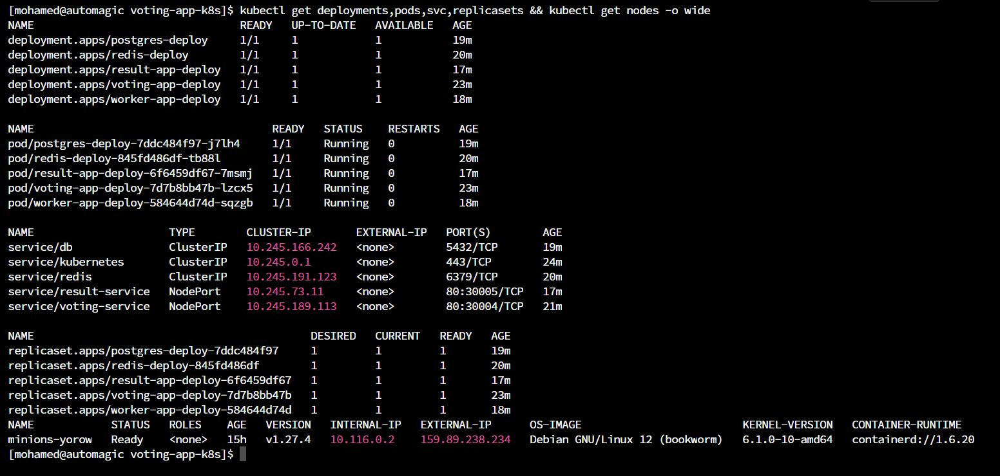

[![LinkedIn][linkedin-shield]][linkedin-url]

<!-- PROJECT LOGO -->
 

  
  <h3 align="center">Voting Stack Deployment on Kubernetes</h3>

<!-- TABLE OF CONTENTS -->

  
Table of Contents

  <ol>
    <li>
      <a href="#about-the-project">About The Project</a>
      <ul>
        <li><a href="#description">Description</a></li>
        <li><a href="#tech-stack">Tech Stack</a></li>
      </ul>
    </li>
    <li><a href="#contact">Contact</a></li>
  </ol>

<!-- ABOUT THE PROJECT -->
## About The Project

* Project Name: Voting Stack Deployment on Kubernetes
* Version: v1.0.0
* Organization Department: Technology

### Description
This project involves deploying a comprehensive voting application stack with the following components:

Front-end Web App (Python): A user-friendly web application built in Python. It enables users to cast their votes from two available options.

Redis: This component gathers incoming votes, acting as an intermediary data store.

.NET Worker: A background worker built on the .NET framework. It consumes votes from Redis and persistently stores them.

Postgres Database: A PostgreSQL database is utilized to store the votes permanently. Docker volume is employed to manage data storage.

Real-time Result Web App (Node.js): A dynamic web application developed using Node.js. It presents real-time updates of the ongoing voting results.

#### Architecture

The project is packaged with pod, deployment, and service definition files. The services are exposed via NodePort service type, allowing external access to the frontend services. The stack encompasses the entire voting process, from user interaction to real-time result display, while ensuring efficient data handling and persistence.

(<a href="#readme-top">back to top</a>)

### Tech Stack

This project was developed using the following tech stack:

* Kubernetes
* DigitalOcean Cloud hosting provider

(<a href="#readme-top">back to top</a>)

<!-- CONTACT -->
## Contact

Mohamed AbdelGawad Ibrahim - [@m-abdelgawad](https://www.linkedin.com/in/m-abdelgawad/) - <a href="tel:+201069052620">+201069052620</a>

(<a href="#readme-top">back to top</a>)

<!-- MARKDOWN LINKS & IMAGES -->
<!-- https://www.markdownguide.org/basic-syntax/#reference-style-links -->
[linkedin-shield]: https://img.shields.io/badge/-LinkedIn-black.svg?style=for-the-badge&logo=linkedin&colorB=555
[linkedin-url]: https://www.linkedin.com/in/m-abdelgawad/
